# 재사용 가능한 자동 영상 엔진 설계

검증일: 2026-07-28
적용 순서: InvestBoard 뉴스 영상 검증 → Promotion Map 사이트 홍보 영상 확장

## 1. 결론

자동 영상 엔진은 특정 AI나 렌더링 업체의 요청 형식을 제품의 중심 모델로 사용하지 않는다.

우리 시스템이 아래 네 가지를 소유한다.

1. 출처와 확인된 사실을 담는 `SourcePack`
2. 대본·장면·자산·음성·자막·고지를 담는 `VideoSpec`
3. 사실·권리·규제·브랜드 검수와 승인 이력
4. 게시 성과와 사이트 유입을 연결하는 측정 데이터

Gemini, TTS, 렌더링 API, 영상 게시 API는 교체 가능한 공급자로 둔다. 이 경계를 지키면 InvestBoard에서는 뉴스가 소스가 되고, Promotion Map에서는 고객 사이트와 고객이 확인한 상품 정보가 소스가 되지만 이후 제작 파이프라인은 공유할 수 있다.

첫 구현은 다음 범위로 제한한다.

- InvestBoard의 검수된 뉴스 후보 한 건
- Gemini 구조화 대본
- 고객 또는 서비스가 권리를 가진 차트·타이포그래피·이미지
- 한국어 TTS
- 장면 단위 자막
- 9:16, 1080×1920 MP4
- 콘텐츠 스튜디오 미리보기와 다운로드
- 외부 자동 게시 없음

## 2. 제품 연결

### 2.1 InvestBoard

- 입력: 뉴스 후보, 출처, 발행 시각, 시장지표, 검색 관심도, 사이트 반응
- 가치: “무슨 일이 있었는가”보다 원인·영향·다음 확인 지표를 설명
- CTA: 관련 브리핑, 가이드, 시장지표 또는 계산기
- 제한: 기사 본문 낭독, 기사 사진 무단 사용, 매수·매도 지시 금지

### 2.2 Promotion Map

- 입력: 고객 사이트 URL, 사이트 분석 결과, 고객이 수정한 브리프, 브랜드 자산, 목표, 고객, 예산
- 가치: 사이트나 상품의 확인된 장점을 목표 고객에게 맞는 숏폼으로 변환
- CTA: 고객이 승인한 랜딩·상담·가입·구매 URL
- 제한: 사이트만 보고 성과·가격·인증·효능을 추정하지 않으며 규제 업종은 자동 공개 차단

### 2.3 공통 부분과 다른 부분

| 구분 | InvestBoard | Promotion Map | 공통 엔진 |
|---|---|---|---|
| 소스 | 뉴스·공식자료·시장 데이터 | 고객 사이트·고객 확인 정보 | `SourcePack` |
| 목표 | 금융 이슈 설명과 사이트 유입 | 고객 사이트 홍보와 전환 | `CreativeBrief` |
| 대본 | 금융 교육형 | 문제·가치·근거·CTA형 | `VideoSpec` |
| 시각 자료 | 자체 차트·숫자 카드 | 사이트 캡처·브랜드 자산 | `AssetManifest` |
| 고지 | 금융정보·AI·출처 | 광고·AI·규제·브랜드 | `ComplianceDecision` |
| 결과 | MP4·게시 성과·사이트 CTR | MP4·캠페인 성과·전환 | `RenderJob`, `Publication`, `PerformanceSnapshot` |

## 3. 전체 플로우

```mermaid
flowchart LR
    S["원본 소스"] --> I["소스 어댑터"]
    I --> P["SourcePack"]
    P --> G["사실·권리·규제 게이트"]
    G --> B["CreativeBrief"]
    B --> L["Gemini 대본·장면 생성"]
    L --> V["내부 VideoSpec 검증"]
    V --> A["자산 계획·수집"]
    A --> T["TTS·자막 타이밍"]
    T --> R["렌더 공급자"]
    R --> Q["비공개 미리보기·사람 승인"]
    Q --> O["다운로드 또는 승인형 게시"]
    O --> M["조회·유지율·사이트 유입"]
    M --> B
```



LLM은 원문 URL이나 HTML을 직접 명령으로 실행하지 않는다. 격리된 수집기가 필요한 정보만 추출하고, 사용자가 확인할 수 있는 사실 데이터로 정규화한 뒤 생성 모델에 전달한다.

## 4. 핵심 데이터 계약

### 4.1 SourcePack

```json
{
  "id": "src_...",
  "tenantId": "investboard",
  "sourceType": "NEWS_ARTICLE",
  "canonicalUrl": "https://...",
  "capturedAt": "2026-07-28T00:00:00Z",
  "title": "확인된 제목",
  "summary": "확인된 요약",
  "claims": [
    {
      "text": "영상에서 사용할 수 있는 사실",
      "sourceUrl": "https://...",
      "observedAt": "2026-07-28T00:00:00Z",
      "confidence": "HIGH",
      "status": "VERIFIED"
    }
  ],
  "assets": [
    {
      "assetId": "asset_...",
      "type": "CHART",
      "rightsBasis": "OWNED",
      "owner": "InvestBoard",
      "expiresAt": null
    }
  ],
  "targetAudience": "한국 개인 투자자",
  "objective": "EXPLAIN_AND_DRIVE_QUALIFIED_VISIT",
  "ctaUrl": "https://investboard.cloud/...",
  "restrictions": ["NO_BUY_SELL_ADVICE", "NO_GUARANTEED_RETURN"]
}
```

Promotion Map에서는 `sourceType`을 `WEBSITE`로 바꾸고 아래 필드를 추가한다.

- 고객이 확인한 업종·상품·가격·지역
- 핵심 고객과 캠페인 목표
- 고객이 승인한 로고·폰트·색상·사진·영상
- 금지 표현과 필수 문구
- CTA와 UTM
- 자산별 권리 보증과 사용 만료일

### 4.2 VideoSpec

```json
{
  "version": 1,
  "projectId": "video_...",
  "sourcePackId": "src_...",
  "aspectRatio": "9:16",
  "width": 1080,
  "height": 1920,
  "fps": 30,
  "durationTargetSeconds": 50,
  "language": "ko-KR",
  "templateKey": "EXPLAINER_V1",
  "voice": {
    "provider": "GEMINI",
    "voiceId": "approved-voice",
    "style": "clear, calm, credible"
  },
  "scenes": [
    {
      "order": 1,
      "durationSeconds": 5,
      "narration": "장면 내레이션",
      "onScreenText": "핵심 문구",
      "visualType": "NUMBER_CARD",
      "assetIds": [],
      "sourceClaimIds": ["claim_1"]
    }
  ],
  "captions": {
    "mode": "SCENE_ALIGNED",
    "maxLines": 2,
    "highlightKeywords": true
  },
  "audio": {
    "musicAssetId": null,
    "targetLoudnessLufs": -14
  },
  "disclosures": ["AI 보조 제작", "정보 제공 목적"],
  "requiresHumanReview": true
}
```

모든 공급자 어댑터는 이 내부 계약을 받아 자신의 요청 형식으로 변환한다. 공급자 응답 ID, 비용, 처리시간, 오류는 별도 `ProviderRun`으로 기록한다.

## 5. 작업 상태

```text
SOURCE_PENDING
→ SOURCE_READY
→ FACT_REVIEW_REQUIRED
→ SCRIPT_DRAFTED
→ SCRIPT_APPROVED
→ ASSETS_READY
→ AUDIO_READY
→ RENDER_QUEUED
→ RENDERING
→ RENDERED
→ RENDER_REVIEW_REQUIRED
→ APPROVED
→ EXPORTED
→ PUBLISHED
→ MEASURED
```

실패 상태는 원인을 유지한다.

- `SOURCE_FAILED`
- `GENERATION_FAILED`
- `ASSET_RIGHTS_BLOCKED`
- `TTS_FAILED`
- `RENDER_FAILED`
- `PUBLICATION_FAILED`

같은 `projectId + specVersion + provider`에는 idempotency key를 사용해 중복 과금과 중복 게시를 막는다.

## 6. 외부 서비스 조사

아래 가격과 정책은 2026-07-28 공식 문서 기준이며 실제 계약 전 다시 확인한다.

### 6.1 완성형 렌더링 API

| 선택지 | 장점 | 단점·위험 | 현재 판단 |
|---|---|---|---|
| Shotstack | JSON 타임라인, 템플릿, 웹훅, 1080p, 편집기 SDK. 월 $39에 200분 수준 | 외부 처리·보관, 공급자 종속, TTS 별도 | 가장 빠른 유료 검증 후보 |
| Creatomate | 웹 템플릿 편집기, API, 브라우저 Preview SDK, 대량 생성 | 개인 플랜 $54부터, 회사·Preview SDK는 상위 플랜, 렌더는 30일 후 삭제 | 고객 편집기가 중요해질 때 후보 |
| JSON2Video | JSON API, TTS·자막 포함, 월 $49.95에 200분 | 디자인 편집과 공급자 교체 유연성이 상대적으로 낮음 | 가장 단순한 비교 후보 |
| 자체 FFmpeg | 가장 낮은 장기 변동비, 전체 제어, 내부 VideoSpec과 직접 결합 | 템플릿·폰트·한글 줄바꿈·렌더 인프라·라이선스 준수 직접 구현 | 장기 기본 엔진 후보 |
| Remotion | React로 장면 개발, 미리보기, 서버 렌더가 편리 | 회사·영상 생성 서비스에는 라이선스 필요. 회사 클라우드 렌더 라이선스 최소 금액이 존재 | 무료라고 가정하지 말고 별도 비용 비교 |

#### 150개 60초 영상의 월 렌더 기준

- Shotstack: 150분 사용 시 월 $39 구간 안에 들어갈 수 있다.
- JSON2Video: Professional $49.95의 200분 구간 안에 들어갈 수 있다.
- Creatomate: 크레딧은 해상도·프레임·길이에 따라 달라져 1080p 실제 템플릿으로 재계산해야 한다.
- 자체 렌더: API 분당 비용은 없지만 EC2/Fargate CPU·메모리·저장·개발 유지비와 FFmpeg 라이선스 검토가 필요하다.

결론적으로 유료 렌더 API는 초기에 비싼 선택이 아니다. 10~30편의 포맷 검증에서는 속도가 중요하므로 공급자 어댑터를 만든 뒤 Shotstack sandbox와 자체 FFmpeg 결과를 같은 `VideoSpec`으로 비교하는 것이 적절하다. 외부 계정 생성·유료 구독은 사용자 승인 후 진행한다.

### 6.2 음성·자막

| 선택지 | 장점 | 단점·위험 | 현재 판단 |
|---|---|---|---|
| Gemini TTS | 기존 Gemini 키 활용 가능, 한국어, 말투·속도·톤 제어 | Preview 모델, 단어별 타임코드가 기본 계약에 없음 | InvestBoard 1차 음성 후보 |
| Google Cloud TTS | 한국어 GA 음성, SSML `<mark>` 타임포인트, 다양한 안정 모델 | 별도 GCP 프로젝트·결제·자격증명 | 장면·구문 정렬이 중요할 때 강한 후보 |
| Amazon Polly | 기존 AWS와 결합, 한국어, word/sentence speech marks | 한국어 음색 선택 폭과 자연스러움 비교 필요 | 안정적 fallback 후보 |
| ElevenLabs | 자연스러운 다국어 음성, Forced Alignment로 단어별 시각 제공 | 별도 계정·비용·음성 권리 관리 | 프리미엄 음성·정밀 자막 후보 |

Gemini TTS 60초 오디오는 공식 가격의 초당 25 오디오 토큰과 100만 출력 토큰당 $20을 적용하면 약 $0.03이다. 하루 5편, 월 150편이면 TTS 출력은 약 $4.50이다. 무료 구간과 재시도는 이 계산에서 제외한다.

1차 자막은 장면별 길이로 맞춘다. 정밀한 단어 강조가 실제 완주율을 개선할 때만 Google SSML mark, Polly speech marks, ElevenLabs Forced Alignment 중 하나를 추가한다.

### 6.3 이미지·영상 자산

우선순위는 다음과 같다.

1. 자체 차트·숫자 카드·아이콘·타이포그래피
2. 고객이 직접 업로드하고 권리를 확인한 브랜드 자산
3. 고객 사이트의 허용된 화면 캡처
4. 출처·라이선스를 기록할 수 있는 스톡 자산
5. 꼭 필요한 장면에만 생성 이미지 또는 생성 영상

스톡 후보:

- Pixabay API는 이미지와 영상을 검색할 수 있고 콘텐츠 라이선스가 적용되지만, 결과 화면에서 출처 표시를 요청한다.
- Pexels API는 이미지·영상 검색을 제공하며 생산 사용 전 API 약관과 표시 조건을 검토한다.
- Unsplash API는 핫링크·사진가/Unsplash 표시·다운로드 이벤트 요구가 있어 렌더된 MP4 자산 파이프라인의 기본값으로 쓰지 않는다.

Veo 3.1은 8초 생성 영상을 만들 수 있지만 720p 기준 초당 $0.05~$0.40이다. 8초 한 장면만 써도 약 $0.40~$3.20이므로 기본 배경이 아니라 성과가 검증된 프리미엄 장면에만 사용한다.

기사 원문 이미지는 라이선스가 따로 확인되지 않으면 사용하지 않는다. Promotion Map의 고객 사이트 이미지도 “사이트에 공개돼 있다”는 사실만으로 재광고 권리를 가정하지 않고 고객의 권리 확인을 저장한다.

### 6.4 아바타 영상

HeyGen API는 아바타 또는 임의 이미지, 대본·음성, 자막, 9:16 출력, 웹훅을 지원한다. 그러나 현재 목표는 사진·차트·자막 중심의 설명형 영상이므로 기본 파이프라인에 넣지 않는다.

아바타는 다음 조건을 통과한 유료 옵션으로만 검토한다.

- 사용자가 해당 얼굴·목소리 사용 권리를 보유
- 합성 콘텐츠 고지 승인
- 일반 설명형 영상보다 전환 또는 제작시간이 실제 개선
- 영상당 원가와 환불·재생성 정책이 확정

## 7. 권장 공급자 전략

### 7.1 첫 번째 기술 검증

- 대본: 기존 `gemini-3.1-flash-lite`
- 음성: Gemini TTS
- 자막: 장면 단위
- 장면: 자체 SVG/PNG 카드, 차트, 브랜드 요소
- 렌더 A: 자체 FFmpeg worker
- 렌더 B: 사용자 승인 후 Shotstack sandbox
- 저장: 로컬 임시 저장 후 운영 단계에서는 S3
- 공개: 없음

같은 `VideoSpec`으로 두 결과를 비교한다.

- 개발시간
- 렌더 성공률
- 렌더 소요시간
- 영상당 실제 비용
- 자막·한글 줄바꿈 정확성
- 디자인 수정 소요시간
- 공급자 장애 시 재처리 가능성

### 7.2 선택 기준

다음 중 하나라도 자체 렌더가 크게 불리하면 초기에는 외부 렌더 API를 사용한다.

- 10편 렌더 성공률 95% 미만
- 한 편 디자인 수정 20분 초과
- 운영 API와 같은 EC2에서 CPU·메모리 경합 발생
- 장애 원인과 재시도 상태를 추적하기 어려움

반대로 외부 렌더 원가가 매출총이익을 훼손하거나 필요한 디자인을 표현하지 못하면 FFmpeg worker로 전환한다. `VideoSpec`과 공급자 어댑터를 분리했기 때문에 전환 시 대본·승인·성과 데이터는 유지된다.

## 8. 구현 경계

### 8.1 프론트

`MONEY_PROJECT_FRONT`의 콘텐츠 스튜디오에 추가한다.

- 소스와 확인된 사실
- 대본 편집
- 장면 순서·길이·화면 문구 편집
- 사용할 자산과 권리 상태
- 음성 샘플
- 렌더 요청
- 작업 진행 상태
- 비공개 미리보기
- 검수 체크리스트와 승인
- MP4 다운로드

브라우저 로컬 저장소가 아니라 서버 작업 ID로 상태를 조회한다.

### 8.2 백엔드

`MONEY_PROJECT`에 API·DB·큐 상태를 둔다.

- `video_projects`
- `source_packs`
- `source_claims`
- `video_specs`
- `media_assets`
- `provider_runs`
- `render_jobs`
- `review_decisions`
- `publications`
- `performance_snapshots`

렌더는 API 요청 스레드에서 실행하지 않는다. 초기에는 DB 기반 큐와 별도 worker 컨테이너를 사용할 수 있고, Promotion Map 멀티테넌트 단계에서는 SQS와 ECS/Fargate 작업으로 옮긴다. 실패 작업은 DLQ 또는 동등한 실패 큐에서 재처리한다.

### 8.3 공급자 인터페이스

```text
ScriptProvider
VoiceProvider
CaptionAlignmentProvider
AssetProvider
RenderProvider
PublicationProvider
AnalyticsProvider
```

각 실행은 아래 공통 정보를 남긴다.

- provider
- model 또는 API version
- request id
- idempotency key
- startedAt / completedAt
- input hash / output hash
- status / error code
- actual cost / currency
- retention or deletion deadline

## 9. 보안·권리·정책 게이트

- 외부 HTML은 신뢰하지 않는 데이터로 취급하고 프롬프트 명령을 제거한다.
- 사이트 분석 worker는 SSRF, DNS rebinding, 리디렉션, 크기·시간 제한을 적용한다.
- 고객·프로젝트·자산·렌더를 `tenantId`로 격리한다.
- 외부 공급자에는 필요한 최소 정보만 보내고 비밀값·회원 데이터·불필요한 원문을 전달하지 않는다.
- 무료 AI 구간의 데이터 사용 조건과 유료 구간의 데이터 처리 조건을 구분한다.
- 고객 자산은 소유·라이선스·동의 근거와 삭제 요청 경로를 보관한다.
- 타인 음성 복제는 금지하고 본인 음성도 명시적 동의·철회·보관기간이 필요하다.
- 금융·보험·의료·건강기능식품·법률 등 규제 업종은 사람이 승인하기 전 렌더 또는 공개 단계를 차단할 수 있다.
- 모든 생성 영상은 사실과 추론, AI 사용, 광고·제휴 관계를 필요한 수준으로 고지한다.
- 사용자 승인 없는 외부 게시·예약·광고 집행은 하지 않는다.

## 10. 단계별 개발 계획

### VE-001 — SourcePack과 VideoSpec

- 기존 콘텐츠 후보와 대본 응답을 버전이 있는 내부 계약으로 변환
- JSON Schema 검증
- source claim과 scene 연결
- 공급자 이름이 제품 핵심 모델에 새지 않도록 분리

완료 기준:

- 기존 뉴스 후보 한 건이 `SourcePack → VideoSpec`으로 변환된다.
- 잘못된 길이·장면·출처·CTA·권리 상태를 검증에서 거부한다.

### VE-002 — 음성·장면·로컬 렌더 수직 기능

- Gemini TTS 어댑터
- 장면 단위 자막
- 숫자 카드·차트·텍스트 템플릿 3개
- FFmpeg MP4 렌더
- 렌더 로그·비용·오류 저장

완료 기준:

- 검수된 대본 한 건으로 9:16 MP4가 생성된다.
- 10편 연속 렌더 성공률 95% 이상
- 잘린 자막·범위 밖 요소·무음·길이 오차 자동 검사

### VE-003 — 콘텐츠 스튜디오 검수

- 대본·장면 편집
- 자산 권리 확인
- 음성 미리듣기
- 렌더 요청·상태·영상 미리보기
- 승인·수정·폐기 이력

완료 기준:

- 검수 이력이 브라우저가 아닌 서버에 남는다.
- 승인되지 않은 영상은 외부 게시 상태로 갈 수 없다.

### VE-004 — 외부 렌더 비교 실험

- 사용자 승인 후 Shotstack sandbox 계정·키 연결
- 동일한 `VideoSpec` 10건을 자체 렌더와 비교
- 실제 비용·시간·품질 기록

완료 기준:

- 선택 근거가 실측 데이터로 남는다.
- 공급자를 바꿔도 기존 프로젝트와 검수 이력이 유지된다.

### VE-005 — Promotion Map 어댑터

- 안전한 사이트 분석 결과와 사용자 수정 브리프를 `SourcePack`으로 변환
- 브랜드 키트·자산 권리·규제 업종 필드
- 문제 → 가치 → 근거 → CTA 숏폼 템플릿
- 테넌트·쿼터·영상당 원가

선행 조건:

- InvestBoard 10편 수동 파일럿 완료
- 영상당 비용과 재생성률 측정
- Marketing 저장소와 배포 경계 승인

### VE-006 — 승인형 게시와 성과 회수

- YouTube 비공개 업로드
- Instagram 전문 계정 게시 준비
- UTM과 영상 ID 연결
- 조회·유지율·완주율·사이트 CTR 회수

외부 계정·OAuth·게시 승인 후에만 시작한다.

## 11. 성공·중단 기준

### 기술 지표

- 대본 생성 성공률 95% 이상
- 렌더 성공률 95% 이상
- 중복 렌더·중복 과금·중복 게시 0건
- 자막 또는 화면 잘림 자동검사 누락 0건
- 출처·권리 상태가 없는 사용 자산 0건
- 한 편당 실제 변동비와 처리시간 기록률 100%

### 제품 지표

- 10편 중 운영자가 게시 가치가 있다고 평가한 영상 5편 이상
- 초안 생성부터 검수 가능한 MP4까지 사람 작업 10분 이하
- 수동 편집 대비 제작시간 50% 이상 감소
- 게시 파일럿에서는 3초 유지율, 평균 시청 비율, 완주율, 사이트 CTR을 영상·템플릿별로 기록

### 중단·재설계

- 사실 오류 10% 초과가 두 번 연속 발생
- 권리 출처가 불명확한 자산이 필요한 포맷
- 재생성률 30% 초과
- 영상당 원가가 계획한 판매가격의 30%를 초과
- 반복 템플릿이 플랫폼 정책 또는 시청자 신뢰를 훼손

## 12. 승인 필요 항목

사용자 승인 없이 진행하지 않는다.

- Shotstack, Creatomate, JSON2Video, ElevenLabs, HeyGen 등 외부 계정 생성
- 유료 API 또는 구독 시작
- 새로운 AWS/GCP 유료 리소스
- OAuth 범위와 게시 계정 연결
- 외부 공개·예약·삭제
- 생성 이미지·생성 영상의 유료 사용
- 음성 복제와 얼굴·아바타 사용

저장소 내부 계약·UI·로컬 렌더·테스트·비공개 파일 생성은 위 승인을 받기 전에도 개발할 수 있다.

## 13. 확인한 공식 자료

- [Gemini TTS](https://ai.google.dev/gemini-api/docs/speech-generation)
- [Gemini API 가격](https://ai.google.dev/gemini-api/docs/pricing)
- [Google Cloud TTS 한국어 음성](https://cloud.google.com/text-to-speech/docs/voices)
- [Google Cloud TTS SSML timepoints](https://docs.cloud.google.com/text-to-speech/docs/ssml)
- [Amazon Polly speech marks](https://docs.aws.amazon.com/polly/latest/dg/speechmarks.html)
- [ElevenLabs Forced Alignment](https://elevenlabs.io/docs/overview/capabilities/forced-alignment)
- [Shotstack API](https://shotstack.io/docs/api/)
- [Shotstack 가격](https://shotstack.io/pricing/)
- [Creatomate template render API](https://creatomate.com/docs/api/quick-start/create-a-video-by-template)
- [Creatomate 가격](https://creatomate.com/pricing)
- [JSON2Video 가격](https://json2video.com/pricing/)
- [Remotion](https://www.remotion.dev/)
- [FFmpeg 라이선스](https://ffmpeg.org/legal.html)
- [Pixabay API](https://pixabay.com/api/docs/)
- [Unsplash API 지침](https://help.unsplash.com/en/articles/2511245-unsplash-api-guidelines)
- [HeyGen Create Video API](https://developers.heygen.com/reference/create-video)
- [AWS Step Functions ECS/Fargate 연동](https://docs.aws.amazon.com/step-functions/latest/dg/connect-ecs.html)
- [Amazon SQS DLQ](https://docs.aws.amazon.com/AWSSimpleQueueService/latest/SQSDeveloperGuide/sqs-dead-letter-queues.html)
