# 재사용 가능한 자동 영상 엔진 설계

검증일: 2026-08-02
적용 순서: InvestBoard 뉴스 영상 검증 → Promotion Map 사이트 홍보 영상 확장

## 1. 결론

자동 영상 엔진은 특정 AI나 렌더링 업체의 요청 형식을 제품의 중심 모델로 사용하지 않는다.

우리 시스템이 아래 네 가지를 소유한다.

1. 출처와 확인된 사실을 담는 `SourcePack`
2. 대본·장면·자산·음성·자막·고지를 담는 `VideoSpec`
3. 사실·권리·규제·브랜드 검수와 승인 이력
4. 게시 성과와 사이트 유입을 연결하는 측정 데이터

Gemini, TTS, 렌더링 API, 영상 게시 API는 교체 가능한 공급자로 둔다. 이 경계를 지키면 InvestBoard에서는 뉴스가 소스가 되고, Promotion Map에서는 고객 사이트와 고객이 확인한 상품 정보가 소스가 되지만 이후 제작 파이프라인은 공유할 수 있다.

첫 구현은 다음 범위로 제한한다.

- InvestBoard의 검수된 뉴스 후보 한 건
- Gemini 구조화 대본
- 고객 또는 서비스가 권리를 가진 차트·타이포그래피·이미지
- 한국어 TTS
- 장면 단위 자막
- 9:16, 1080×1920 MP4
- 콘텐츠 스튜디오 미리보기와 다운로드
- 외부 자동 게시 없음

## 2. 제품 연결

### 2.1 InvestBoard

- 입력: 뉴스 후보, 출처, 발행 시각, 시장지표, 검색 관심도, 사이트 반응
- 가치: “무슨 일이 있었는가”보다 원인·영향·다음 확인 지표를 설명
- CTA: 관련 브리핑, 가이드, 시장지표 또는 계산기
- 제한: 기사 본문 낭독, 기사 사진 무단 사용, 매수·매도 지시 금지

### 2.2 Promotion Map

- 입력: 고객 사이트 URL, 사이트 분석 결과, 고객이 수정한 브리프, 브랜드 자산, 목표, 고객, 예산
- 가치: 사이트나 상품의 확인된 장점을 목표 고객에게 맞는 숏폼으로 변환
- CTA: 고객이 승인한 랜딩·상담·가입·구매 URL
- 제한: 사이트만 보고 성과·가격·인증·효능을 추정하지 않으며 규제 업종은 자동 공개 차단

### 2.3 공통 부분과 다른 부분

| 구분 | InvestBoard | Promotion Map | 공통 엔진 |
|---|---|---|---|
| 소스 | 뉴스·공식자료·시장 데이터 | 고객 사이트·고객 확인 정보 | `SourcePack` |
| 목표 | 금융 이슈 설명과 사이트 유입 | 고객 사이트 홍보와 전환 | `CreativeBrief` |
| 대본 | 금융 교육형 | 문제·가치·근거·CTA형 | `VideoSpec` |
| 시각 자료 | 자체 차트·숫자 카드 | 사이트 캡처·브랜드 자산 | `AssetManifest` |
| 고지 | 금융정보·AI·출처 | 광고·AI·규제·브랜드 | `ComplianceDecision` |
| 결과 | MP4·게시 성과·사이트 CTR | MP4·캠페인 성과·전환 | `RenderJob`, `Publication`, `PerformanceSnapshot` |

## 3. 전체 플로우

```mermaid
flowchart LR
    S["원본 소스"] --> I["소스 어댑터"]
    I --> P["SourcePack"]
    P --> G["사실·권리·규제 게이트"]
    G --> B["CreativeBrief"]
    B --> L["Gemini 대본·장면 생성"]
    L --> V["내부 VideoSpec 검증"]
    V --> A["자산 계획·수집"]
    A --> T["TTS·자막 타이밍"]
    T --> R["렌더 공급자"]
    R --> Q["비공개 미리보기·사람 승인"]
    Q --> O["다운로드 또는 승인형 게시"]
    O --> M["조회·유지율·사이트 유입"]
    M --> B
```



LLM은 원문 URL이나 HTML을 직접 명령으로 실행하지 않는다. 격리된 수집기가 필요한 정보만 추출하고, 사용자가 확인할 수 있는 사실 데이터로 정규화한 뒤 생성 모델에 전달한다.

### 3.1 첫 영상 포맷 — `IMAGE_EXPLAINER_V1`

첫 버전은 생성 영상이나 아바타 없이 관련 이미지 5~7장, 자체 숫자 카드·차트, AI 음성, 큰 자막만 사용한다. 한 편은 45~55초이며 장면은 2~10초마다 바뀐다.

| 구간 | 길이 | 화면 | 음성 목적 |
|---|---:|---|---|
| 훅 | 0~3초 | 가장 강한 이미지, 질문형 문구, 핵심 숫자 | 답을 바로 다 말하지 않고 확인할 이유 제시 |
| 상황 | 3~8초 | 사건·기업·시장 관련 이미지 | 무슨 일이 있었는지 한 문장으로 설명 |
| 핵심 숫자 | 8~16초 | 자체 숫자 카드 또는 차트 | 변화 폭과 기준 시점을 명확히 설명 |
| 이유 | 16~27초 | 원인과 맞는 이미지 1~2장 | 가장 가능성 높은 원인과 근거 설명 |
| 내 영향 | 27~38초 | 생활·산업·시장 영향 이미지 | 시청자에게 왜 중요한지 연결 |
| 다음 확인 | 38~47초 | 체크리스트 또는 캘린더 카드 | 앞으로 확인할 지표 하나 제시 |
| CTA·고지 | 47~53초 | InvestBoard 상세 페이지와 출처 | 더 자세한 설명으로 연결하고 금융정보 고지 |

화면 규격:

- 9:16, 1080×1920, 30fps
- 이미지에는 3~6%의 느린 확대·이동을 넣고 장면 전환은 120~250ms로 제한
- 이미지 위에 어두운 그라데이션을 적용해 자막 대비를 유지
- 자막은 화면 중앙보다 약간 아래에 최대 두 줄, 한 줄 9~16자
- 플랫폼 버튼이 겹치는 오른쪽 140px, 하단 300px에는 핵심 텍스트를 배치하지 않음
- 강조 단어는 한 구절에 하나만 색상 또는 크기로 표시
- 출처와 고지는 마지막 장면과 상세 페이지에 남김

“궁금하게 만드는 억양”은 과장된 문장보다 정보의 순서로 만든다.

1. 첫 3초에 질문 또는 예상 밖의 숫자를 제시한다.
2. 8초 안에 사건 자체는 설명한다.
3. 원인과 영향 사이에 짧은 질문을 한 번 둔다.
4. 38초 전에는 핵심 답을 제공한다.
5. 제목에 없는 충격·폭락·무조건·지금 사야 한다 같은 표현은 생성 검증에서 거부한다.

### 3.1.1 2026-08-02 숏폼 스타일 개선

현재 운영 렌더는 기본 Polly 음성과 자동 생성 카드만으로도 실패 없이 MP4를 만들지만, 사람의
캐릭터와 실제 제품 맥락이 약하다. 다음 순서로 개선한다.

1. 장면마다 고객이 사용권을 가진 실제 사진·화면 녹화·짧은 MP4를 직접 넣는다.
2. 영상 클립은 장면 음성 길이만큼 반복하고 9:16 중앙 크롭하며 원본 소리는 사용하지 않는다.
3. 자산이 없는 장면만 권리 확인 스톡을 사용하고, 그마저 없으면 자체 카드로 대체한다.
4. 음성은 `NATURAL`, `WHISPER`, `SNARKY` 세 스타일로 제한해 결과를 비교한다.
5. `WHISPER`와 `SNARKY`는 ElevenLabs v3의 전달 태그 또는 Typecast의 감정·속도·피치처럼
   표현 제어를 지원하는 공급자가 설정됐을 때만 허용하고 Polly에는 억지 음성 변조를 적용하지 않는다.

특정 크리에이터나 실존 인물의 음성을 복제하지 않는다. 원하는 결과는 “누구 목소리”가 아니라
한국어, 약한 비음, 가까운 마이크 질감, 짧은 호흡, 약간 시니컬한 전달처럼 독립된 특성으로 정의한다.

첫 운영 포맷은 30~45초, 7장면을 유지하되 첫 장면은 2초 안에 문제를 제시한다. 이후 실제 성과에서
`시청 선택 대 스와이프`, 평균 시청 시간, 이탈 구간을 비교해 장면 길이와 음성 스타일을 보정한다.

### 3.2 관련 이미지 선택

Gemini는 장면마다 한국어·영어 검색어, 필요한 피사체, 금지 요소를 구조화해 반환한다. `AssetProvider`는 다음 순서로 자산을 결정한다.

1. InvestBoard가 직접 만든 차트·숫자 카드
2. 권리가 확인된 내부·고객 자산
3. Pixabay 또는 Pexels의 관련 스톡 이미지·영상
4. 검색 결과가 부정확하면 이미지 대신 자체 타이포그래피 카드

Pixabay는 첫 스톡 공급자 후보로 둔다. 이미지·영상 검색, 세로 방향, 안전 검색, 인기순을 지원하며 결과와 함께 원본 페이지·작가·라이선스 확인 시각을 저장한다. API 검색 결과는 24시간 캐시하고 실제 렌더 자산은 서버에 내려받는다.

관련성은 제목의 단어 일치만으로 결정하지 않는다. 장면의 피사체·산업·지역·분위기 일치, 해상도, 세로 크롭 가능성, 중복 여부를 점수화한다. 얼굴·로고·특정 기업·사건 현장처럼 오인 가능성이 높은 이미지는 자동 선택하지 않고 자체 카드로 대체한다.

기사 원문의 썸네일과 본문 이미지는 별도 사용권이 확인되지 않으면 사용하지 않는다.

현재 구현 우선순위는 `사용자 업로드 → Pixabay 이미지 → 자체 카드`다. 사용자 업로드는 JPG, PNG,
WebP, MP4, WebM, MOV로 제한하고 서버가 생성한 참조값만 렌더 요청에 전달한다. 백엔드 수신
한도는 파일당 25MB이지만 현재 Vercel Function을 경유하는 브라우저 업로드는 4.5MB 요청 한도와
multipart 여유를 고려해 파일당 4MB로 제한한다. 긴 원본은 장면별 5~6초 클립으로 잘라 압축한다.
대용량 원본 업로드 수요가 검증되면 미디어 스토리지의 짧은 수명 presigned URL로 직접 업로드한다.
AI 이미지·영상 공급자를 추가하더라도 결과를 자동 게시하지 않고, 생성한 파일을 동일한 사용자 자산
검수 흐름에 넣어 사실성·상표·인물·사용권을 확인한다.

### 3.3 억양과 자막 타이밍

대본 생성 결과에 다음 전달 지시를 포함한다.

```json
{
  "captionChunks": [
    {
      "text": "환율이 다시 움직였습니다.",
      "delivery": "CURIOUS",
      "rate": 1.03,
      "emphasis": ["다시"],
      "pauseAfterMs": 140
    }
  ]
}
```

TTS 공급자가 스타일을 지원하면 `CURIOUS`, `SURPRISED`, `DETERMINED`, `CALM`을 해당 공급자의 SSML 또는 스타일로 변환한다. 지원하지 않으면 짧은 구절, 문장부호, 속도, 구절 사이 쉼으로 표현한다.

자막은 첫 버전부터 음성에 맞춘다.

1. 대본을 자막 구절 단위로 나눈다.
2. 각 구절의 음성을 별도 파일로 생성한다.
3. `ffprobe`로 실제 음성 길이를 측정한다.
4. 지정된 쉼을 더해 누적 시작·종료 시각을 계산한다.
5. SRT와 ASS 자막을 만들고 음성 파일을 순서대로 결합한다.

이 방식은 공급자가 단어 타임스탬프를 주지 않아도 구절 단위 자막을 정확히 맞춘다. 공급자가 Polly speech marks나 Azure WordBoundary를 제공할 때만 단어별 강조 자막을 선택적으로 만든다.

### 3.4 MP4 렌더와 미리보기

FFmpeg worker는 다음 순서로 렌더한다.

1. 이미지를 9:16에 맞게 크롭·확대하고 흐린 배경 또는 그라데이션을 생성
2. 장면별 확대·이동, 숫자 카드, 로고, 출처를 합성
3. 구절 음성과 쉼을 결합하고 전체 음량을 정규화
4. ASS 자막을 입히고 장면을 연결
5. H.264 영상과 AAC 음성의 MP4를 `faststart` 옵션으로 생성
6. 해상도, 길이, 무음, 검은 프레임, 자막 안전 영역을 자동 검사

콘텐츠 스튜디오의 첫 미리보기는 540×960, 낮은 비트레이트로 빠르게 만든다. 브라우저의 `<video controls>`에서 재생하고 장면별 대본·이미지·억양을 수정한다. 수정할 때 기존 파일을 덮어쓰지 않고 `VideoSpec` 버전을 올린다. 사용자가 승인하면 같은 spec으로 1080×1920 최종본을 생성하고 MP4를 다운로드하게 한다.

## 4. 핵심 데이터 계약

### 4.1 SourcePack

```json
{
  "id": "src_...",
  "tenantId": "investboard",
  "sourceType": "NEWS_ARTICLE",
  "canonicalUrl": "https://...",
  "capturedAt": "2026-07-28T00:00:00Z",
  "title": "확인된 제목",
  "summary": "확인된 요약",
  "claims": [
    {
      "text": "영상에서 사용할 수 있는 사실",
      "sourceUrl": "https://...",
      "observedAt": "2026-07-28T00:00:00Z",
      "confidence": "HIGH",
      "status": "VERIFIED"
    }
  ],
  "assets": [
    {
      "assetId": "asset_...",
      "type": "CHART",
      "rightsBasis": "OWNED",
      "owner": "InvestBoard",
      "expiresAt": null
    }
  ],
  "targetAudience": "한국 개인 투자자",
  "objective": "EXPLAIN_AND_DRIVE_QUALIFIED_VISIT",
  "ctaUrl": "https://investboard.cloud/...",
  "restrictions": ["NO_BUY_SELL_ADVICE", "NO_GUARANTEED_RETURN"]
}
```

Promotion Map에서는 `sourceType`을 `WEBSITE`로 바꾸고 아래 필드를 추가한다.

- 고객이 확인한 업종·상품·가격·지역
- 핵심 고객과 캠페인 목표
- 고객이 승인한 로고·폰트·색상·사진·영상
- 금지 표현과 필수 문구
- CTA와 UTM
- 자산별 권리 보증과 사용 만료일

### 4.2 VideoSpec

```json
{
  "version": 1,
  "projectId": "video_...",
  "sourcePackId": "src_...",
  "aspectRatio": "9:16",
  "width": 1080,
  "height": 1920,
  "fps": 30,
  "durationTargetSeconds": 50,
  "language": "ko-KR",
  "templateKey": "EXPLAINER_V1",
  "voice": {
    "provider": "GEMINI",
    "voiceId": "approved-voice",
    "style": "clear, calm, credible"
  },
  "scenes": [
    {
      "order": 1,
      "durationSeconds": 5,
      "narration": "장면 내레이션",
      "onScreenText": "핵심 문구",
      "visualType": "NUMBER_CARD",
      "assetIds": [],
      "sourceClaimIds": ["claim_1"]
    }
  ],
  "captions": {
    "mode": "SCENE_ALIGNED",
    "maxLines": 2,
    "highlightKeywords": true
  },
  "audio": {
    "musicAssetId": null,
    "targetLoudnessLufs": -14
  },
  "disclosures": ["AI 보조 제작", "정보 제공 목적"],
  "requiresHumanReview": true
}
```

모든 공급자 어댑터는 이 내부 계약을 받아 자신의 요청 형식으로 변환한다. 공급자 응답 ID, 비용, 처리시간, 오류는 별도 `ProviderRun`으로 기록한다.

## 5. 작업 상태

```text
SOURCE_PENDING
→ SOURCE_READY
→ FACT_REVIEW_REQUIRED
→ SCRIPT_DRAFTED
→ SCRIPT_APPROVED
→ ASSETS_READY
→ AUDIO_READY
→ RENDER_QUEUED
→ RENDERING
→ RENDERED
→ RENDER_REVIEW_REQUIRED
→ APPROVED
→ EXPORTED
→ PUBLISHED
→ MEASURED
```

실패 상태는 원인을 유지한다.

- `SOURCE_FAILED`
- `GENERATION_FAILED`
- `ASSET_RIGHTS_BLOCKED`
- `TTS_FAILED`
- `RENDER_FAILED`
- `PUBLICATION_FAILED`

같은 `projectId + specVersion + provider`에는 idempotency key를 사용해 중복 과금과 중복 게시를 막는다.

## 6. 외부 서비스 조사

아래 가격과 정책은 2026-07-28 공식 문서 기준이며 실제 계약 전 다시 확인한다.

### 6.1 완성형 렌더링 API

| 선택지 | 장점 | 단점·위험 | 현재 판단 |
|---|---|---|---|
| Shotstack | JSON 타임라인, 템플릿, 웹훅, 1080p, 편집기 SDK. 월 $39에 200분 수준 | 외부 처리·보관, 공급자 종속, TTS 별도 | 가장 빠른 유료 검증 후보 |
| Creatomate | 웹 템플릿 편집기, API, 브라우저 Preview SDK, 대량 생성 | 개인 플랜 $54부터, 회사·Preview SDK는 상위 플랜, 렌더는 30일 후 삭제 | 고객 편집기가 중요해질 때 후보 |
| JSON2Video | JSON API, TTS·자막 포함, 월 $49.95에 200분 | 디자인 편집과 공급자 교체 유연성이 상대적으로 낮음 | 가장 단순한 비교 후보 |
| 자체 FFmpeg | 가장 낮은 장기 변동비, 전체 제어, 내부 VideoSpec과 직접 결합 | 템플릿·폰트·한글 줄바꿈·렌더 인프라·라이선스 준수 직접 구현 | 장기 기본 엔진 후보 |
| Remotion | React로 장면 개발, 미리보기, 서버 렌더가 편리 | 회사·영상 생성 서비스에는 라이선스 필요. 회사 클라우드 렌더 라이선스 최소 금액이 존재 | 무료라고 가정하지 말고 별도 비용 비교 |

#### 150개 60초 영상의 월 렌더 기준

- Shotstack: 150분 사용 시 월 $39 구간 안에 들어갈 수 있다.
- JSON2Video: Professional $49.95의 200분 구간 안에 들어갈 수 있다.
- Creatomate: 크레딧은 해상도·프레임·길이에 따라 달라져 1080p 실제 템플릿으로 재계산해야 한다.
- 자체 렌더: API 분당 비용은 없지만 EC2/Fargate CPU·메모리·저장·개발 유지비와 FFmpeg 라이선스 검토가 필요하다.

결론적으로 유료 렌더 API는 초기에 비싼 선택이 아니다. 10~30편의 포맷 검증에서는 속도가 중요하므로 공급자 어댑터를 만든 뒤 Shotstack sandbox와 자체 FFmpeg 결과를 같은 `VideoSpec`으로 비교하는 것이 적절하다. 외부 계정 생성·유료 구독은 사용자 승인 후 진행한다.

### 6.2 음성·자막

| 선택지 | 장점 | 단점·위험 | 현재 판단 |
|---|---|---|---|
| Azure Speech F0 | 한국어 남녀 음성, 일부 한국어 음성의 감정 스타일, WordBoundary, 월 50만 자 무료 | 별도 Azure 계정·리소스·키 필요 | 무료 품질·억양 비교 1순위 |
| Amazon Polly | 기존 AWS와 결합, 한국어 `Seoyeon`·`Jihye`, word/sentence speech marks | 한국어 전용 감정 스타일이 제한적이고 프리 티어는 계정 조건 확인 필요 | 운영 연결 1순위 |
| Typecast API | 한국어 감정형 음성과 한 호출의 음성·단어/문자 타임스탬프 응답 | API 키·voice ID·상업 이용 요금 확인 필요 | 코드 어댑터 구현, 승인 후 품질 비교 |
| Supertone API | 한국어, 스타일·속도·피치 제어, 국내 콘텐츠에 맞는 표현력 | 무료 월 5분은 표시 조건이 있고 상업 운영은 요금제 확인 필요 | 한국어 프리미엄 음성 비교 후보 |
| MeloTTS Korean | MIT, 한국어, CPU 실시간 추론, 외부 API 비용 없음 | 음성 품질·감정 표현·서버 자원과 모델 공급망을 직접 관리 | 완전 로컬 무료 fallback |
| Google Cloud TTS | 한국어 음성, SSML `<mark>`, 월 100만~400만 자 무료 구간 | 결제 사용 설정과 별도 GCP 자격증명 필요 | 안정성 비교 후보 |
| ElevenLabs | 표현력 높은 다국어 음성, 정밀 정렬 | 무료는 약 10~20분 수준이고 별도 계정·권리 관리 필요 | 유료 프리미엄 후보 |
| Gemini TTS | 기존 Gemini 키 활용 가능, 한국어, 말투·속도·톤 제어 | Preview 모델, 단어별 타임코드가 기본 계약에 없음 | 기존 비교 기준 |

Gemini TTS 60초 오디오는 공식 가격의 초당 25 오디오 토큰과 100만 출력 토큰당 $20을 적용하면 약 $0.03이다. 하루 5편, 월 150편이면 TTS 출력은 약 $4.50이다. 무료 구간과 재시도는 이 계산에서 제외한다.

하루 5편, 편당 대본 500자라면 월 약 7만 5천 자다. Amazon Polly Neural 음성과 speech marks를 각각 호출해 15만 자가 과금돼도 프리 티어 밖 비용은 공식 단가 기준 약 $2.40이다. Azure F0의 월 50만 자와 Google Cloud의 무료 한도 안에도 들어간다. 무료 한도 초과를 막기 위해 공급자별 월 문자 제한과 차단 임계값을 애플리케이션에 둔다.

API 비용을 완전히 없애려면 MeloTTS Korean을 별도 worker에서 실행할 수 있다. 모델 카드상 MIT이며 상업·비상업 사용이 가능하지만, 실제 배포 전 코드·모델·의존 데이터의 라이선스를 다시 고정하고 음질을 사람 평가한다. XTTS-v2는 한국어를 지원해도 모델 라이선스가 비상업용이므로 수익화 제품에는 사용하지 않는다.

추천 실험은 동일한 대본 10개를 Amazon Polly, Azure F0, MeloTTS로 생성해 자연스러움·집중도·발음 오류·생성시간·비용을 블라인드 평가하는 것이다. 새 Azure 계정 생성은 사용자 승인 후 진행한다.

현재 코드에는 Polly와 Typecast가 동일한 `VoiceProvider` 경계로 구현돼 있다. 기본값은 Polly이며,
Typecast는 사용자가 별도 계정·약관·비용을 승인하고 키를 넣기 전에는 호출되지 않는다.

### 6.3 이미지·영상 자산

우선순위는 다음과 같다.

1. 자체 차트·숫자 카드·아이콘·타이포그래피
2. 고객이 직접 업로드하고 권리를 확인한 브랜드 자산
3. 고객 사이트의 허용된 화면 캡처
4. 출처·라이선스를 기록할 수 있는 스톡 자산
5. 꼭 필요한 장면에만 생성 이미지 또는 생성 영상

스톡 후보:

- Pixabay API는 이미지와 영상을 검색할 수 있고 콘텐츠 라이선스가 적용되지만, 결과 화면에서 출처 표시를 요청한다.
- Pexels API는 이미지·영상 검색을 제공하며 생산 사용 전 API 약관과 표시 조건을 검토한다.
- Unsplash API는 핫링크·사진가/Unsplash 표시·다운로드 이벤트 요구가 있어 렌더된 MP4 자산 파이프라인의 기본값으로 쓰지 않는다.

영상 전달·변환 보조 후보:

- Cloudinary는 이미지·영상 연결, 자막·텍스트·이미지 레이어, URL 변환을 제공한다. S3와 CDN까지
  한 공급자로 단순화할 때 유용하지만, 현재 7장면 전체 타임라인을 직접 소유하려는 구조에서는
  FFmpeg를 대체하기보다 선택형 저장·변환 어댑터가 적합하다.
- Shotstack·Creatomate는 템플릿 편집과 렌더 운영을 빠르게 외주화할 때 유리하다. 10편 자체 렌더의
  실패율 또는 수정 시간이 기준을 넘을 때만 동일한 내부 spec으로 비교한다.

Veo 3.1은 8초 생성 영상을 만들 수 있지만 720p 기준 초당 $0.05~$0.40이다. 8초 한 장면만 써도 약 $0.40~$3.20이므로 기본 배경이 아니라 성과가 검증된 프리미엄 장면에만 사용한다.

기사 원문 이미지는 라이선스가 따로 확인되지 않으면 사용하지 않는다. Promotion Map의 고객 사이트 이미지도 “사이트에 공개돼 있다”는 사실만으로 재광고 권리를 가정하지 않고 고객의 권리 확인을 저장한다.

### 6.4 아바타 영상

HeyGen API는 아바타 또는 임의 이미지, 대본·음성, 자막, 9:16 출력, 웹훅을 지원한다. 그러나 현재 목표는 사진·차트·자막 중심의 설명형 영상이므로 기본 파이프라인에 넣지 않는다.

아바타는 다음 조건을 통과한 유료 옵션으로만 검토한다.

- 사용자가 해당 얼굴·목소리 사용 권리를 보유
- 합성 콘텐츠 고지 승인
- 일반 설명형 영상보다 전환 또는 제작시간이 실제 개선
- 영상당 원가와 환불·재생성 정책이 확정

## 7. 권장 공급자 전략

### 7.1 첫 번째 기술 검증

- 대본: 기존 `gemini-3.1-flash-lite`
- 음성 A: 기존 AWS 계정의 Amazon Polly Neural
- 음성 B: 사용자 승인 후 Azure Speech F0
- 음성 C: 로컬 MeloTTS Korean
- 자막: 음성 구절 길이 기반, 가능한 공급자는 word boundary 추가
- 장면: 관련 스톡 이미지 5~7장, 자체 SVG/PNG 카드와 차트
- 렌더 A: 자체 FFmpeg worker
- 렌더 B: 사용자 승인 후 Shotstack sandbox
- 저장: 로컬 임시 저장 후 운영 단계에서는 S3
- 공개: 없음

같은 `VideoSpec`으로 두 결과를 비교한다.

- 개발시간
- 렌더 성공률
- 렌더 소요시간
- 영상당 실제 비용
- 자막·한글 줄바꿈 정확성
- 디자인 수정 소요시간
- 공급자 장애 시 재처리 가능성

### 7.2 선택 기준

다음 중 하나라도 자체 렌더가 크게 불리하면 초기에는 외부 렌더 API를 사용한다.

- 10편 렌더 성공률 95% 미만
- 한 편 디자인 수정 20분 초과
- 운영 API와 같은 EC2에서 CPU·메모리 경합 발생
- 장애 원인과 재시도 상태를 추적하기 어려움

반대로 외부 렌더 원가가 매출총이익을 훼손하거나 필요한 디자인을 표현하지 못하면 FFmpeg worker로 전환한다. `VideoSpec`과 공급자 어댑터를 분리했기 때문에 전환 시 대본·승인·성과 데이터는 유지된다.

## 8. 구현 경계

### 8.1 프론트

`MONEY_PROJECT_FRONT`의 콘텐츠 스튜디오에 추가한다.

- 소스와 확인된 사실
- 대본 편집
- 장면 순서·길이·화면 문구 편집
- 사용할 자산과 권리 상태
- 음성 샘플
- 렌더 요청
- 작업 진행 상태
- 비공개 미리보기
- 검수 체크리스트와 승인
- MP4 다운로드

브라우저 로컬 저장소가 아니라 서버 작업 ID로 상태를 조회한다.

### 8.2 백엔드

`MONEY_PROJECT`에 API·DB·큐 상태를 둔다.

- `video_projects`
- `source_packs`
- `source_claims`
- `video_specs`
- `media_assets`
- `provider_runs`
- `render_jobs`
- `review_decisions`
- `publications`
- `performance_snapshots`

렌더는 API 요청 스레드에서 실행하지 않는다. 초기에는 DB 기반 큐와 별도 worker 컨테이너를 사용할 수 있고, Promotion Map 멀티테넌트 단계에서는 SQS와 ECS/Fargate 작업으로 옮긴다. 실패 작업은 DLQ 또는 동등한 실패 큐에서 재처리한다.

첫 10편 기술 검증에서는 별도 서버 비용을 만들지 않기 위해 `news-service` 안의 단일 비동기
executor를 사용한다. 동시에 한 편만 처리하고 대기열은 8개로 제한한다. API 응답 스레드는 렌더를
기다리지 않는다. 렌더 CPU가 뉴스 수집·조회에 영향을 주거나 10편 성공률이 95% 미만이면 이 임시
구조를 중단하고 렌더 컨테이너를 분리한다.

### 8.3 공급자 인터페이스

```text
ScriptProvider
VoiceProvider
CaptionAlignmentProvider
AssetProvider
RenderProvider
PublicationProvider
AnalyticsProvider
```

각 실행은 아래 공통 정보를 남긴다.

- provider
- model 또는 API version
- request id
- idempotency key
- startedAt / completedAt
- input hash / output hash
- status / error code
- actual cost / currency
- retention or deletion deadline

## 9. 보안·권리·정책 게이트

- 외부 HTML은 신뢰하지 않는 데이터로 취급하고 프롬프트 명령을 제거한다.
- 사이트 분석 worker는 SSRF, DNS rebinding, 리디렉션, 크기·시간 제한을 적용한다.
- 고객·프로젝트·자산·렌더를 `tenantId`로 격리한다.
- 외부 공급자에는 필요한 최소 정보만 보내고 비밀값·회원 데이터·불필요한 원문을 전달하지 않는다.
- 무료 AI 구간의 데이터 사용 조건과 유료 구간의 데이터 처리 조건을 구분한다.
- 고객 자산은 소유·라이선스·동의 근거와 삭제 요청 경로를 보관한다.
- 타인 음성 복제는 금지하고 본인 음성도 명시적 동의·철회·보관기간이 필요하다.
- 금융·보험·의료·건강기능식품·법률 등 규제 업종은 사람이 승인하기 전 렌더 또는 공개 단계를 차단할 수 있다.
- 모든 생성 영상은 사실과 추론, AI 사용, 광고·제휴 관계를 필요한 수준으로 고지한다.
- 사용자 승인 없는 외부 게시·예약·광고 집행은 하지 않는다.

## 10. 단계별 개발 계획

### VE-001 — SourcePack과 VideoSpec

- 기존 콘텐츠 후보와 대본 응답을 버전이 있는 내부 계약으로 변환
- JSON Schema 검증
- source claim과 scene 연결
- 공급자 이름이 제품 핵심 모델에 새지 않도록 분리

완료 기준:

- 기존 뉴스 후보 한 건이 `SourcePack → VideoSpec`으로 변환된다.
- 잘못된 길이·장면·출처·CTA·권리 상태를 검증에서 거부한다.

### VE-002 — 음성·장면·로컬 렌더 수직 기능

- Gemini TTS 어댑터
- 장면 단위 자막
- 숫자 카드·차트·텍스트 템플릿 3개
- FFmpeg MP4 렌더
- 렌더 로그·비용·오류 저장

완료 기준:

- 검수된 대본 한 건으로 9:16 MP4가 생성된다.
- 10편 연속 렌더 성공률 95% 이상
- 잘린 자막·범위 밖 요소·무음·길이 오차 자동 검사

2026-07-28 1차 구현:

- `POST /api/content-videos/render`, 작업 상태, MP4 스트리밍 API와 DB 작업 이력
- Amazon Polly Neural 음성과 speech marks 기반 구절 자막
- Typecast의 음성+단어 타임스탬프 선택형 어댑터
- Pixabay 세로 안전 검색, 작가·원본 페이지 크레딧, 실패 시 자체 생성 카드
- 540×960 미리보기와 1080×1920 최종본, 느린 확대, ASS 한글 자막, H.264/AAC MP4
- 한 작업씩 처리하는 비동기 큐와 실패 사유 저장
- 자막 타이밍·ASS·자체 카드 단위 테스트 및 Java 17 타깃 전체 테스트 통과

남은 완료 조건:

- 실제 Money EC2의 Polly 권한으로 첫 MP4 렌더
- 10편 연속 렌더 성공률·시간·EC2 CPU/메모리 측정
- 영상 해상도·무음·검은 프레임·안전영역 자동 검사

### VE-003 — 콘텐츠 스튜디오 검수

- 대본·장면 편집
- 자산 권리 확인
- 음성 미리듣기
- 렌더 요청·상태·영상 미리보기
- 승인·수정·폐기 이력

완료 기준:

- 검수 이력이 브라우저가 아닌 서버에 남는다.
- 승인되지 않은 영상은 외부 게시 상태로 갈 수 없다.

2026-07-28 1차 구현:

- 대본을 정확히 7장면 이미지 설명형 포맷으로 생성하고 장면별 자산 검색어를 구조화
- 대본을 `사용 가능`으로 검수한 뒤에만 미리보기·최종본 렌더 버튼 활성화
- 서버 작업 ID의 진행률·단계·오류 조회
- 브라우저 비공개 MP4 재생, 다운로드, 이미지 출처 확인
- 서버 간 렌더 키는 브라우저에 노출하지 않는 Next.js 프록시
- Next.js Production 빌드와 ESLint 오류 0건

남은 완료 조건:

- 대본·장면 수정 UI
- 자산별 선택·권리 승인과 검수 이력의 서버 저장
- 음성 미리듣기와 동일 spec 버전 재렌더

### VE-004 — 외부 렌더 비교 실험

- 사용자 승인 후 Shotstack sandbox 계정·키 연결
- 동일한 `VideoSpec` 10건을 자체 렌더와 비교
- 실제 비용·시간·품질 기록

완료 기준:

- 선택 근거가 실측 데이터로 남는다.
- 공급자를 바꿔도 기존 프로젝트와 검수 이력이 유지된다.

### VE-005 — Promotion Map 어댑터

- 안전한 사이트 분석 결과와 사용자 수정 브리프를 `SourcePack`으로 변환
- 브랜드 키트·자산 권리·규제 업종 필드
- 문제 → 가치 → 근거 → CTA 숏폼 템플릿
- 테넌트·쿼터·영상당 원가

선행 조건:

- InvestBoard 10편 수동 파일럿 완료
- 영상당 비용과 재생성률 측정
- Marketing 저장소와 배포 경계 승인

### VE-006 — 승인형 게시와 성과 회수

- YouTube 비공개 업로드
- Instagram 전문 계정 게시 준비
- UTM과 영상 ID 연결
- 조회·유지율·완주율·사이트 CTR 회수

외부 계정·OAuth·게시 승인 후에만 시작한다.

### VE-007 — 참고영상 구조 분석과 선택형 AI 장면

검증일: 2026-08-02

참고 YouTube URL은 영상이나 대본을 내려받아 재사용하는 입력이 아니다. 사용자가 분석 권한과 외부
비용 가능성을 확인한 경우에만 Apify Actor가 공개 자막의 타임코드와 메타데이터를 읽고 다음 파생값만
`ReferenceVideoAnalysis`로 반환한다.

- 전체 길이와 자막 구간 수
- 평균 자막 구간 길이와 첫 5초 구간 수
- 초당 문자 수로 계산한 정보 밀도
- 사용자가 직접 작성한 스타일 프롬프트

자막 원문은 프론트, Gemini 프롬프트, 데이터베이스에 저장하지 않는다. Apify가 없거나 자막이 없거나
실패해도 사용자가 쓴 스타일 프롬프트로 대본을 생성해 기존 렌더 경로를 유지한다.

Higgsfield는 전체 영상 제작 엔진이 아니라 장면 자산 공급자로 둔다. 운영자가 장면별 버튼을 눌렀을
때만 다음 비동기 작업을 실행한다.

1. `higgsfield-ai/soul/standard`로 텍스트 기반 9:16 기준 이미지를 생성한다.
2. `higgsfield-ai/dop/standard`로 기준 이미지를 5초 무자막 영상으로 변환한다.
3. 결과 URL의 HTTPS·공개 IP·형식·25MB 제한을 검증하고 서버 볼륨에 내려받는다.
4. 기존 사용자 업로드와 같은 `assetRef`로 저장해 TTS·ASS 자막·FFmpeg 렌더에 넣는다.

한 영상의 AI 장면은 최대 2개로 제한한다. 실제 사이트 화면, 제품 사진, 사용자 촬영 영상이 우선이며
AI 장면은 자료가 없는 문제 상황·분위기 장면만 보완한다. 글자·로고·공인·저작권 캐릭터·가짜 UI는
생성 프롬프트에서 금지하고, 사실적인 생성물은 게시 전 플랫폼 AI 표시 여부를 사람이 확인한다.

외부 자격증명이 없을 때의 결과 경로는 그대로 유지된다.

`사용자 자산 → Pixabay → 자체 카드 → 음성·자막·FFmpeg MP4`

연결 시에만 사용할 서버 환경변수:

- `APIFY_REFERENCE_ENABLED=true`, `APIFY_API_TOKEN`
- `HIGGSFIELD_ENABLED=true`, `HIGGSFIELD_API_KEY`, `HIGGSFIELD_API_SECRET`

두 서비스 모두 별도 약관·비용 승인이 필요하며 자동 게시나 자동 대량 생성을 활성화하지 않는다.

## 11. 성공·중단 기준

### 기술 지표

- 대본 생성 성공률 95% 이상
- 렌더 성공률 95% 이상
- 중복 렌더·중복 과금·중복 게시 0건
- 자막 또는 화면 잘림 자동검사 누락 0건
- 출처·권리 상태가 없는 사용 자산 0건
- 한 편당 실제 변동비와 처리시간 기록률 100%

### 제품 지표

- 10편 중 운영자가 게시 가치가 있다고 평가한 영상 5편 이상
- 초안 생성부터 검수 가능한 MP4까지 사람 작업 10분 이하
- 수동 편집 대비 제작시간 50% 이상 감소
- 게시 파일럿에서는 3초 유지율, 평균 시청 비율, 완주율, 사이트 CTR을 영상·템플릿별로 기록

### 중단·재설계

- 사실 오류 10% 초과가 두 번 연속 발생
- 권리 출처가 불명확한 자산이 필요한 포맷
- 재생성률 30% 초과
- 영상당 원가가 계획한 판매가격의 30%를 초과
- 반복 템플릿이 플랫폼 정책 또는 시청자 신뢰를 훼손

## 12. 승인 필요 항목

사용자 승인 없이 진행하지 않는다.

- Azure Speech, Pixabay, Pexels, Shotstack, Creatomate, JSON2Video, ElevenLabs, HeyGen 등 외부 계정 생성
- 유료 API 또는 구독 시작
- 새로운 AWS·Azure·GCP 유료 리소스
- OAuth 범위와 게시 계정 연결
- 외부 공개·예약·삭제
- 생성 이미지·생성 영상의 유료 사용
- 음성 복제와 얼굴·아바타 사용

저장소 내부 계약·UI·로컬 렌더·테스트·비공개 파일 생성은 위 승인을 받기 전에도 개발할 수 있다.

### 12.1 현재 운영 연결에 필요한 수작업

코드는 외부 계정 없이 배포 가능하지만 영상 기능은 안전하게 기본 비활성화돼 있다.

1. 현재 Money EC2 인스턴스 프로파일에 최소 `polly:SynthesizeSpeech` 권한을 추가한다.
2. GitHub Actions 서버 저장소 secret에 `VIDEO_RENDER_ENABLED=true`와
   `VIDEO_RENDER_ACCESS_KEY=<충분히 긴 임의값>`을 넣는다.
3. Vercel에는 같은 `VIDEO_RENDER_ACCESS_KEY`를 넣는다. 기존
   `CONTENT_STUDIO_ACCESS_KEY`와 같은 값을 서버 GitHub secret에도 넣는다면 Vercel 신규 등록은
   생략할 수 있지만, 키 회전과 권한 분리를 위해 별도 키를 권장한다.
4. Pixabay 계정과 키를 사용하기로 승인한 경우에만 서버 secret `PIXABAY_API_KEY`를 넣는다.
   없어도 자체 생성 카드로 영상은 만들어진다.
5. Production을 다시 배포하고 콘텐츠 스튜디오에서 초안 승인 → 540×960 미리보기 순으로 확인한다.

현재 로컬에 연결된 AWS 자격증명은 Money EC2가 있는 계정을 가리키지 않아, 다른 계정의 인스턴스에
권한을 추가하지 않았다.

## 13. 확인한 공식 자료

- [Gemini TTS](https://ai.google.dev/gemini-api/docs/speech-generation)
- [Gemini API 가격](https://ai.google.dev/gemini-api/docs/pricing)
- [Google Cloud TTS 한국어 음성](https://cloud.google.com/text-to-speech/docs/voices)
- [Google Cloud TTS 가격과 무료 한도](https://cloud.google.com/text-to-speech/pricing?hl=ko)
- [Google Cloud TTS SSML timepoints](https://docs.cloud.google.com/text-to-speech/docs/ssml)
- [Azure Speech 가격과 F0 무료 한도](https://azure.microsoft.com/en-us/pricing/details/speech/)
- [Azure Speech 한국어 음성과 스타일](https://learn.microsoft.com/en-us/azure/ai-services/speech-service/language-support?tabs=tts)
- [Azure Speech SSML·WordBoundary](https://learn.microsoft.com/en-us/azure/ai-services/speech-service/speech-synthesis-markup-structure)
- [Amazon Polly speech marks](https://docs.aws.amazon.com/polly/latest/dg/speechmarks.html)
- [Amazon Polly 한국어 음성](https://docs.aws.amazon.com/polly/latest/dg/available-voices.html)
- [Amazon Polly 가격과 무료 구간](https://aws.amazon.com/polly/pricing/)
- [Typecast TTS 타임스탬프 API](https://typecast.ai/docs/api-reference/text-to-speech/text-to-speech-with-timestamps)
- [Typecast API 개요](https://typecast.ai/developers/api/)
- [Supertone TTS API](https://docs.supertoneapi.com/en/api-reference/endpoints/text-to-speech)
- [Supertone API 요금](https://www.supertone.ai/en/api)
- [MeloTTS Korean 모델과 라이선스](https://huggingface.co/myshell-ai/MeloTTS-Korean)
- [ElevenLabs Forced Alignment](https://elevenlabs.io/docs/overview/capabilities/forced-alignment)
- [ElevenLabs API 가격](https://elevenlabs.io/pricing/api)
- [Shotstack API](https://shotstack.io/docs/api/)
- [Shotstack 가격](https://shotstack.io/pricing/)
- [Creatomate template render API](https://creatomate.com/docs/api/quick-start/create-a-video-by-template)
- [Creatomate 가격](https://creatomate.com/pricing)
- [JSON2Video 가격](https://json2video.com/pricing/)
- [Remotion](https://www.remotion.dev/)
- [FFmpeg 라이선스](https://ffmpeg.org/legal.html)
- [Pixabay API](https://pixabay.com/api/docs/)
- [Cloudinary 영상 연결](https://cloudinary.com/documentation/video_concatenation)
- [Cloudinary 영상 레이어](https://cloudinary.com/documentation/video_layers)
- [Unsplash API 지침](https://help.unsplash.com/en/articles/2511245-unsplash-api-guidelines)
- [HeyGen Create Video API](https://developers.heygen.com/reference/create-video)
- [Apify MCP 및 Actor 실행](https://docs.apify.com/integrations/mcp)
- [Higgsfield API 사용법](https://docs.higgsfield.ai/docs/how-to/introduction)
- [Higgsfield 이미지 기반 영상 생성](https://docs.higgsfield.ai/docs/guides/video)
- [YouTube 채널 수익화 정책](https://support.google.com/youtube/answer/1311392)
- [YouTube AI 생성·변경 콘텐츠 표시](https://support.google.com/youtube/answer/14328491)
- [AWS Step Functions ECS/Fargate 연동](https://docs.aws.amazon.com/step-functions/latest/dg/connect-ecs.html)
- [Amazon SQS DLQ](https://docs.aws.amazon.com/AWSSimpleQueueService/latest/SQSDeveloperGuide/sqs-dead-letter-queues.html)
